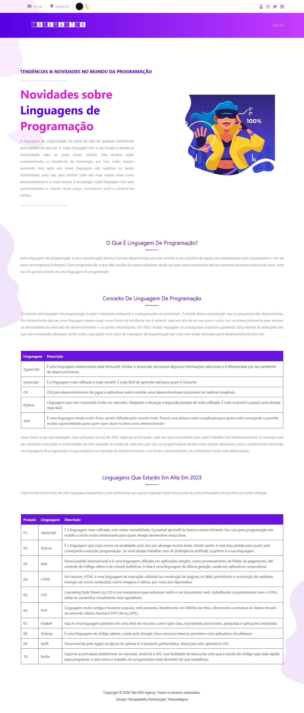

    

<h5>## CODEMASTER: UM JOGO PARA AUXILIAR NA APRENDIZAGEM DE PROGRAMAÇÃO</h5>

<b>Neste projeto foi desenvolvido uma plataforma de jogos educativos, que permita aos usuários aprender de forma dinâmica os conceitos iniciais da programação.</b>

<h3>LINGUAGENS E FRAMEWORKS</h3>
- PHP; 
- LARAVEL 9; 
- JAVASCRIPT; 

<h3>DESENVOLVIMENTO</h3>

    <h3>Página Inicial site</h3>
     
    
    

    <b>Página FAQ</b> 
     
    
    

    <b>Página Jogos</b> 
     
    
    

    <b>Página Têndencias</b> 
     
    
    

    <b>Página Linguagens</b> 
     
    
    

    <b>Página IA</b> 
     
    
    

      <h3>Página Jogo</h3>
       <b>Página Registrar-se</b> 
     
    
    

    <b>Página Login</b> 
     
    
    

    <b>Página Start</b> 
     
    
    

    <b>Página Fases</b> 
     
    
    

    <b>Página Subfases</b> 
     
    
    

    <b>Página Quiz</b> 
     
    
    

    <b>Página Resultado Quiz</b> 
     
    
     
    
    

    <b>Página Rank</b> 
     
    

